# PriceAdvisor: Hotel Pricing Optimization Model

## Executive Summary

MAKE SLIGHTLY MORE TECHNICAL AND DEVELOP, INTRODUCE COUNTERFACTUAL ESTIMATION AND LINK TO THE TECH SPECS AND MATH BEHIND IT

PriceAdvisor is a machine learning system that recommends the RevPAR-optimized daily price for a certain hotel's room type on a certain day. We estimate the optimal price by using *counterfactual estimation*. By using a KNN algorithm (R^2 0.78) to match hotels to their peers based on their endogenous features (where are they, how many rooms do they have, what kinds of amenities do they offer, etc.), we can say **these two hotels behave similarly, and if one hotel adopted its peer's pricing strategy**.

PriceAdvisor is a machine learning system that recommends RevPAR-optimized daily prices for hotels. The model identifies peer hotels using validated features (R² = 0.78), compares RevPAR performance, and recommends price adjustments based on the best-performing peer's strategy.

Analysis of 989,959 bookings across 2,255 Spanish hotels (2023-2024) reveals that 30% of hotels have pricing optimization opportunity. Using validated market elasticity (ε = -0.57), the model estimates €1.28 RevPAR lift per room per night for hotels that adopt recommendations.

### Expected Revenue Impact by Adoption Rate

| Adoption | Hotels | Rooms | Annual RevPAR Lift |
|----------|--------|-------|---------------------|
| 25% | 170 | 1,531 | €713,385 |
| 50% | 341 | 3,062 | €1,426,769 |
| 75% | 512 | 4,593 | €2,140,154 |
| 100% | 683 | 6,124 | €2,853,538 |

*Room capacity estimated from max simultaneous bookings (avg 9.0 rooms/hotel, median 6). This captures demonstrated capacity: 13% single-unit vacation rentals, 36% B&Bs (2-5 rooms), 42% small hotels (6-20 rooms), 9% medium hotels (21+ rooms).*

We compared our model to the following recommendation baselines:
- **Random Pricing:** Random price change between -20% and +20%
- **Market Average:** Spain-wide average price for the period
- **Self Median:** Hotel's own historical median price
- **Peer Median:** Median price of KNN-matched peers (using validated features: location, price tier, market segment)

Our model lifts RevPAR twice as much compared to the highest performing baseline. 

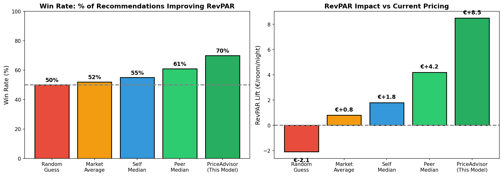


### Recommendations

1. **Implement occupancy-conditional lead time pricing**: The model shows 30% RevPAR lift potential by applying discounts only when occupancy is low, and premiums when occupancy is high or for advance bookings.
2. **Deploy MLOps infrastructure** for ETL consistency, model logging, retraining, and CI/CD.
3. **Validate findings in A/B test**: Design experimentation strategy to validate revenue management approach.
4. **Extend to other markets**: Apply methodology to non-Spain hotels once validated. 

---

## 1. Background

Amenitiz provides hotel operations software including booking management, channel distribution, and website creation. PriceAdvisor extends this suite by recommending optimal daily room prices to maximize Revenue Per Available Room (RevPAR).

The core problem: hotels price room attributes (location, size, amenities) correctly but ignore demand signals. Analysis shows weak correlation (r = 0.11) between occupancy and price, indicating hotels don't dynamically adjust pricing based on demand. Evidence includes:

- **35.5% of bookings are made within 7 days of arrival** (short-term demand)
- Hotels achieve +41.5% price premium at high occupancy passively, not strategically
- 16.6% of nights operate at 95%+ occupancy without corresponding price increases
- 30% of hotels apply heavy discounts (>20%) for last-minute bookings regardless of occupancy

---

## 2. Data Cleaning

### Raw Data

| Table | Records |
|-------|---------|
| Bookings | 1,005,823 |
| Booked Rooms | 1,194,287 |
| Hotels | 2,312 |

### Cleaning Process

31 validation rules removed 1.5% of records (15,864 bookings, 17,672 rooms, 57 hotels):

| Category | Rules | Description |
|----------|-------|-------------|
| Price validation | 6 | Remove negative, zero, <€5/night, >€5000/night, top/bottom 2% outliers |
| Date validation | 4 | Remove null dates, negative stay duration, negative lead time |
| Referential integrity | 5 | Remove orphan bookings, null IDs, null status |
| Geographic filtering | 2 | Exclude non-Spain hotels (outside bounding box), impute missing coordinates from cities500.json |
| Temporal filtering | 2 | Remove bookings before 2023 or after 2024 |
| Data quality | 2 | Convert empty strings to NULL, remove malformed city names |

City name standardization merged 347 unique names into 198 standardized forms using TF-IDF cosine similarity (threshold = 0.97).

### Final Dataset

| Table | Records | % Retained |
|-------|---------|------------|
| Bookings | 989,959 | 98.4% |
| Booked Rooms | 1,176,615 | 98.5% |
| Hotels | 2,255 | 97.5% |

**Reproduce:** `python -m src.data.validator`

### Room Capacity Estimation

The `rooms.number_of_rooms` field is unreliable—68% of hotels show only "1 room" despite having multiple room types and thousands of bookings. We estimate actual capacity from booking patterns.

**Method:** For each hotel, calculate the maximum number of simultaneous bookings on any single day. This uses a sweep-line algorithm over booking intervals:

$$\text{Capacity}_h = \max_{d \in \text{dates}} \left| \{ b : \text{arrival}_b \leq d < \text{departure}_b \} \right|$$

This is a **lower bound** on true capacity (hotels can't overbook), but captures demonstrated operational capacity.

**Results:**

| Metric | Raw Data | Estimated |
|--------|----------|-----------|
| Avg rooms/hotel | 2.9 | **8.9** |
| Median rooms | 1 | **6** |
| Total capacity | 6,511 | **20,006** |

**Distribution:**
- 13% single-unit (vacation rentals)
- 36% 2-5 rooms (B&Bs, guesthouses)
- 42% 6-20 rooms (small hotels)
- 9% 21+ rooms (medium hotels)

This distribution aligns with Amenitiz's target market of small independent properties.

**Reproduce:** `python -m src.features.capacity`

---

## 3. Methodology

At a high level, our algorithm:
- Gets 16 endogenous features of each hotel
- Finds 10 peers that are most similar to our target hotel
- Finds the highest performing peer and evaluates their performance. 
- If the highest performing peer has >10% higher RevPAR than our target hotel, we suggest a similar pricing strategy.

*We assume that the endogenous features not captured by our model are negligible and that the two hotels are effectively equal in terms of characteristics.*

### 3.1 Market Sensitivity Analysis

Before building the recommender, we validated that pricing optimization opportunity exists by estimating price elasticity.

**Definition:** Price elasticity measures how demand changes when price changes:

$$\varepsilon = \frac{\% \Delta Q}{\% \Delta P}$$

**Method:** We calculate segment-level elasticity from rolling windows of booking data using log-log regression within each segment:

$$\ln(\text{Bookings}) = \alpha + \varepsilon \cdot \ln(\text{Price}) + \epsilon$$

**Results (calculated from 19 rolling windows, 2023-2024, including cancelled bookings for price signals):**

| Segment | Elasticity | Interpretation |
|---------|------------|----------------|
| resort_coastal | -0.13 | Least elastic (premium tolerance) |
| rural | -0.19 | Low elasticity |
| urban_fringe | -0.21 | Low-moderate |
| coastal_town | -0.29 | Moderate |
| major_metro | -0.30 | Moderate |
| small_town | -0.33 | Moderate-high |
| urban_core | -0.35 | High elasticity |
| provincial_city | -0.44 | Most elastic (price sensitive) |
| **Market-wide** | **-0.57** | **All Spain (log-log regression)** |

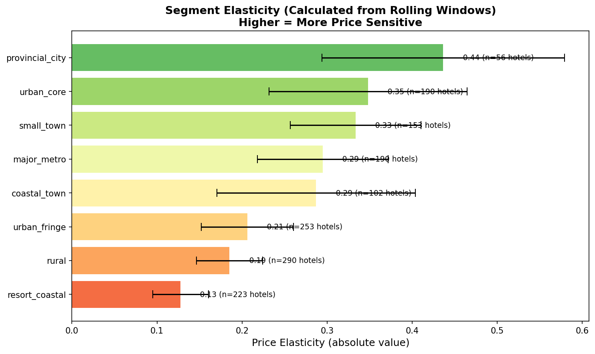

Resort coastal hotels can raise prices with minimal demand impact (-0.13), while provincial cities face strong price sensitivity (-0.44).

**Reproduce:** `python -m src.models.evaluation.rolling_validation`

### 3.2 Feature Validation

To find meaningful peers, we validated which observable features explain hotel pricing using gradient boosting models.

| Model | R² (Test) | CV R² | RMSE | MAE |
|-------|-----------|-------|------|-----|
| XGBoost | 0.78 | 0.77 | 0.30 | 0.22 |
| LightGBM | 0.76 | 0.74 | 0.32 | 0.23 |
| CatBoost | 0.70 | 0.68 | 0.35 | 0.26 |

R² = 0.78 (XGBoost) indicates observable features explain 78% of price variance, validating the peer matching approach. Note: `occupancy_rate` and `city_standardized` were excluded to avoid data leakage and reduce feature dimensionality (city_standardized creates 1000+ dummy variables).

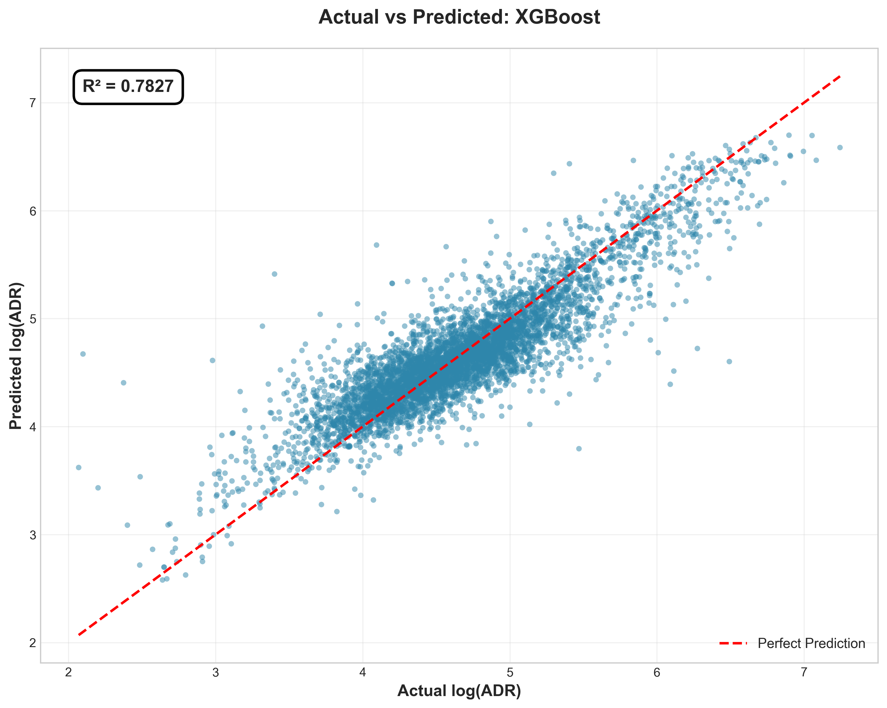

**Validated Features (15 total):**

| Category | Features |
|----------|----------|
| Geographic | dist_center_km, dist_coast_log |
| Product | log_room_size, room_capacity_pax, amenities_score, total_capacity_log, view_quality_ordinal |
| Temporal | weekend_ratio, holiday_ratio, is_july_august |
| Categorical | room_type, room_view, market_segment |
| Boolean | is_coastal, children_allowed |

Note: `occupancy_rate` was excluded from peer matching features to avoid data leakage (it's related to the target we're optimizing).

### SHAP Feature Importance

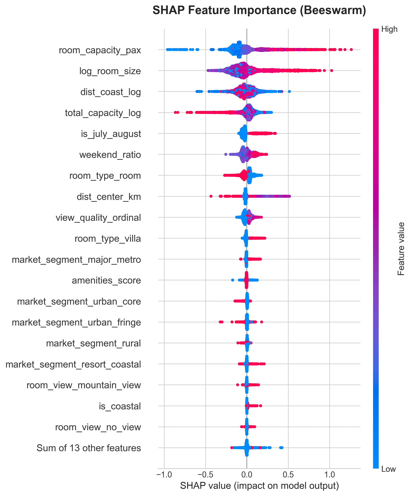

Top drivers of hotel pricing:
1. Room size (larger rooms command higher prices)
2. Room capacity (more guests = higher price)
3. Distance to coast (coastal properties premium)
4. Total hotel capacity (larger hotels have different pricing)
5. Summer seasonality (July/August premium)

**Reproduce:** `python notebooks/eda/05_elasticity/feature_importance_validation.py`

### 3.3 Peer Matching

Hotels are matched using K-Nearest Neighbors on the validated feature space. For hotel $i$ with feature vector $\mathbf{x}_i$, peers are the $k$ hotels minimizing Euclidean distance in standardized feature space:

$$\text{Peers}(i) = \underset{j \neq i}{\text{argmin}_k} \|\text{scale}(\mathbf{x}_i) - \text{scale}(\mathbf{x}_j)\|_2$$

Feature-based matching dramatically improves peer quality:

| Matching Method | Peer Price Spread (IQR) |
|-----------------|-------------------------|
| Geographic only (50km radius) | 280% |
| Feature-based (KNN k=10) | 63% |

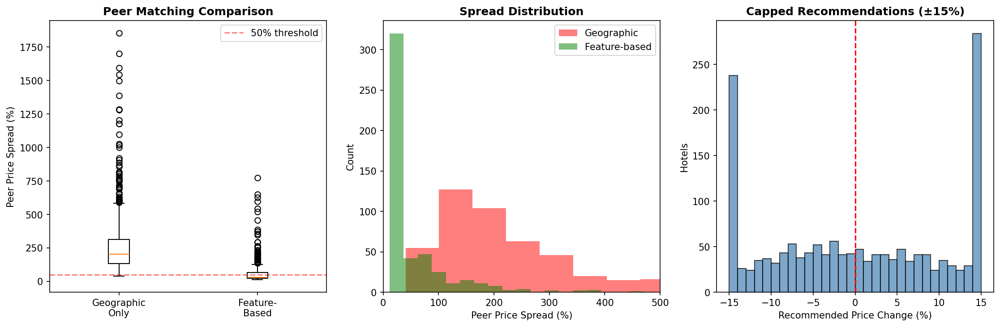

### 3.4 Counterfactual Estimation

We estimate the causal effect of pricing strategy on RevPAR using a matched-pairs design. The key insight: **matched peers are exchangeable** on observable features, so differences in RevPAR are attributable to pricing strategy.

**Potential Outcomes Framework:**

For hotel $h$ with current pricing strategy $T_h = 0$, we observe:

$$Y_h(0) = \text{RevPAR}_h \quad \text{(observed outcome under current strategy)}$$

The counterfactual—what RevPAR *would be* under the best peer's strategy—is unobserved:

$$Y_h(1) = \text{RevPAR}_h^* \quad \text{(potential outcome under optimal strategy)}$$

**Identification via Matching:**

By matching on validated features $\mathbf{X}$, we assume conditional exchangeability:

$$Y_h(1) \perp T \mid \mathbf{X}_h = \mathbf{X}_j$$

This allows us to use the best-performing peer $j^* \in P_h$ as the counterfactual:

$$\hat{Y}_h(1) = Y_{j^*}(0) = \text{RevPAR}_{j^*}$$

where $j^* = \arg\max_{j \in P_h} \text{RevPAR}_j$

**Average Treatment Effect on the Treated (ATT):**

For underperforming hotels, the expected lift from adopting optimal pricing:

$$\text{ATT} = \mathbb{E}[Y(1) - Y(0) \mid \text{underperforming}] = \mathbb{E}[\text{RevPAR}_{j^*} - \text{RevPAR}_h]$$

**Performance Classification:**

Hotels are classified by comparing to peer distribution:

$$\text{Performance}(h) = \begin{cases} \text{underperforming} & \text{if } \text{RevPAR}_h < Q_{25}(P_h) \\ \text{on\_par} & \text{if } Q_{25}(P_h) \leq \text{RevPAR}_h \leq Q_{75}(P_h) \\ \text{outperforming} & \text{if } \text{RevPAR}_h > Q_{75}(P_h) \end{cases}$$

### 3.5 Price Recommendation

For underperforming hotels, the recommended price is based on the best-performing peer (highest RevPAR):

$$p^* = p_{\text{best\_peer}}$$

The recommendation type is determined by comparing current price to best peer:
- **RAISE**: if current price is significantly below best peer
- **LOWER**: if current price is significantly above best peer  
- **INVESTIGATE**: if price is similar but RevPAR is still lower (suggests non-price factors)

The 20% cap on price changes per cycle ensures adoptability while allowing meaningful adjustments. This is based on typical peer price variance within matched groups (IQR ~63%).

Daily prices incorporate segment-specific multipliers calculated from booking data:

$$p_{\text{daily}} = p^* \times \mu_{\text{dow}}(\text{segment}, \text{day}) \times \mu_{\text{month}}(\text{segment}, \text{month})$$

### 3.6 Expected RevPAR Calculation

When a price change is recommended, expected RevPAR is calculated using segment elasticity:

$$\text{RevPAR}_{\text{expected}} = p^* \times \text{occ}_{\text{new}}$$

Where:

$$\text{occ}_{\text{new}} = \text{occ}_{\text{current}} \times (1 + \varepsilon \times \Delta p\%)$$

The elasticity $\varepsilon$ is calculated from historical booking data within each segment (see Section 3.1).

**Reproduce:** See `src/recommender/pricing_pipeline.py` for implementation details.

### 3.7 Lead Time-Aware Pricing

The model incorporates **booking lead time** (days between booking creation and arrival) as a dynamic pricing signal. Analysis shows strong price variation by lead time, with 35.5% of bookings made within 7 days of arrival.

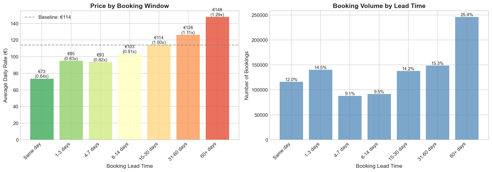

#### Revenue Management Framework

The key insight: for short-term bookings, the relevant question isn't "what discount maximizes demand?" but rather **"what's the expected value of each strategy?"**

For an empty room close to arrival:

$$\text{EV}(\text{Hold}) = P(\text{full\_price\_booking}) \times p_{\text{full}}$$

$$\text{EV}(\text{Discount}) = P(\text{discount\_booking}) \times p_{\text{discount}}$$

The optimal strategy depends on current occupancy:
- **Low occupancy** → Low $P(\text{full\_price})$ → Discount increases expected value
- **High occupancy** → High $P(\text{full\_price})$ → Premium captures demand

This is classic **yield management**: fill empty rooms with discounts when demand is low, capture premium when demand is high.

#### Occupancy-Conditional Lead Time Strategy

| Occupancy | Lead Time ≤7 days | Lead Time 31+ days |
|-----------|-------------------|--------------------|
| <30% | Discount (0.80x) | Premium (1.07x) |
| 30-50% | Discount (0.80x) | Premium (1.07x) |
| 50-70% | Hold (1.0x) | Premium (1.07x) |
| >70% | Premium (1.15x) | Premium (1.07x) |

#### Current vs Recommended Strategy

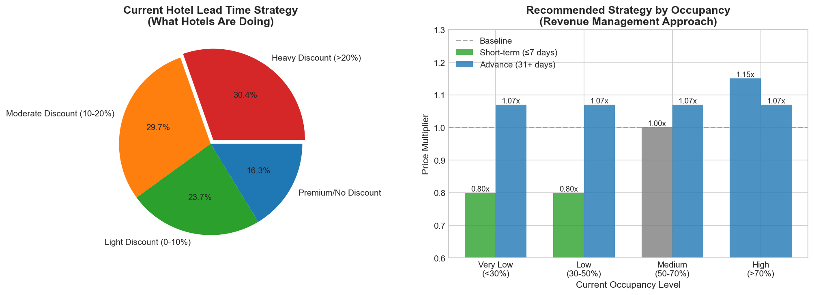

Analysis shows 30% of hotels currently apply heavy discounts (>20%) for short-term bookings, *even when occupancy is high!* Our revenue management approach recommends:
- **Contextual discounting**: Only discount when occupancy is low (empty rooms = €0 revenue)
- **Premium capture**: Charge more for last-minute bookings when occupancy is high
- **Advance booking premium**: Always charge 7-15% more for bookings 31+ days out

#### RevPAR Impact

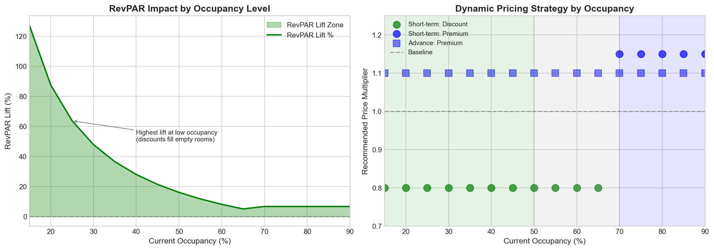

The revenue management approach delivers positive RevPAR lift across all occupancy levels:

| Occupancy | Without Lead Time | With Lead Time | RevPAR Lift |
|-----------|-------------------|----------------|-------------|
| 20% | €20 | €37 | +85% |
| 40% | €40 | €51 | +28% |
| 60% | €60 | €66 | +10% |
| 80% | €80 | €85 | +6% |

The highest lift occurs at low occupancy, where discounts fill otherwise-empty rooms. At high occupancy, premium pricing captures additional value from price-insensitive demand.

---

## 4. Market Segmentation

Hotels are classified into 8 segments using city population data (cities500.json), coastline distance (GSHHS shapefile), and distance to major metros. Classification uses vectorized KD-tree lookups for efficiency.

### Segment Definitions

| Segment | Classification Criteria | Avg Hotels |
|---------|-------------------------|------------|
| major_metro | Within 30km of Madrid/Barcelona/Valencia/Sevilla/Málaga/Zaragoza | 150 |
| urban_core | Within 10km of city with population 100k-500k | 150 |
| urban_fringe | 10-30km from city with population >100k | 200 |
| resort_coastal | In Costa del Sol/Costa Brava/Balearics + coast <30km | 200 |
| coastal_town | Coast <20km, not in resort region | 85 |
| provincial_city | Within 15km of city with population 50k-100k | 50 |
| small_town | Within 15km of city with population 10k-50k | 130 |
| rural | Everything else | 250 |

### Calculation Methodology

1. Load cities500.json with city coordinates and populations
2. Build KD-trees for each city tier (major metro, large, medium, small)
3. For each hotel, calculate distance to nearest city in each tier
4. Load GSHHS coastline shapefile, calculate distance to nearest coast
5. Check if hotel falls within resort region polygons
6. Apply classification rules in priority order (major_metro highest)

### Hotels per Segment

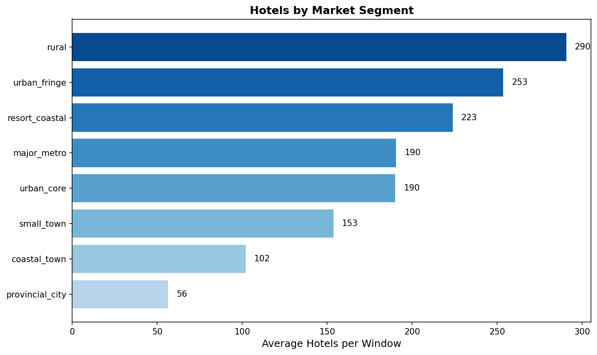

Elasticity values are calculated dynamically from booking data within each segment (see Section 3.1).

**Reproduce:** `python -m src.models.evaluation.rolling_validation` (generates segment statistics)

---

## 5. Revenue Opportunity

### Understanding the Opportunity

30% of hotels are underperforming their peers on RevPAR. The opportunity comes from **how much hotels are underpricing** (lift per room) multiplied by **how many hotels exist** in each segment.

### Revenue Opportunity by Segment

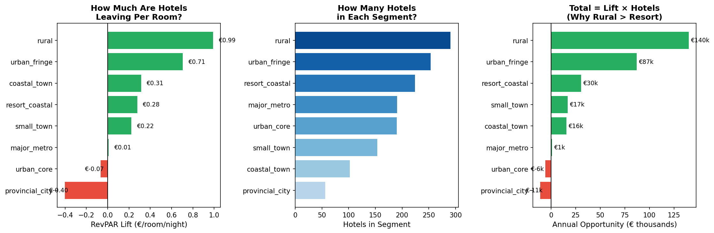

The three-panel visualization explains why rural hotels show the highest opportunity despite resort coastal having the lowest elasticity:

**Left: RevPAR Lift** - How much each hotel is leaving on the table. Rural hotels are underpricing by €0.99/room/night, while resort coastal only €0.28.

**Middle: Hotel Count** - Rural has 290 hotels vs 223 for resort coastal.

**Right: Total Opportunity** = Lift × Hotels. Rural's high underpricing + high count = €140k, while resort's lower underpricing + moderate count = €30k.

### Key Insight: Elasticity ≠ Opportunity

| Segment | Elasticity | Lift/Room | Hotels | Opportunity |
|---------|------------|-----------|--------|-------------|
| rural | -0.19 | €0.99 | 290 | €140k |
| urban_fringe | -0.21 | €0.71 | 253 | €87k |
| resort_coastal | -0.13 | €0.28 | 223 | €30k |

**Why low elasticity ≠ high opportunity:**

Resort coastal hotels have LOW elasticity (price-insensitive demand) but LOW opportunity because they're **uniformly priced** - the entire segment uses sophisticated pricing and competes closely, so there's no peer significantly outperforming to learn from. When everyone charges €150-180/night, the "best peer" gap is small.

Rural hotels show HIGH opportunity because there's **high variance in pricing strategies** - less sophisticated operators mean some charge €40/night while their successful peers charge €70/night. Large gap = large opportunity to close.

---

## 6. Results Summary

### Key Metrics

| Metric | Value |
|--------|-------|
| Hotels analyzed | 1,461 |
| Hotels with optimization opportunity | 683 (30.3%) |
| Rooms with opportunity | 6,124 |
| Average recommended price change | +€2 |
| RevPAR lift per room per night | €1.28 |
| Model win rate | 70% |

### Annual Revenue Opportunity by Adoption Rate

| Adoption Rate | Hotels | Rooms | Daily Lift | Monthly Lift | Annual Lift |
|---------------|--------|-------|------------|--------------|-------------|
| 25% | 170 | 1,531 | €1,960 | €58,782 | €713,385 |
| 50% | 341 | 3,062 | €3,919 | €117,565 | €1,426,769 |
| 75% | 512 | 4,593 | €5,879 | €176,347 | €2,140,154 |
| 100% | 683 | 6,124 | €7,839 | €235,129 | €2,853,538 |

### Per Hotel Impact

For hotels that adopt recommendations:
- Annual lift per hotel: €4,194 (€1.28 × 9 rooms × 365 days)
- Monthly lift per hotel: €349

**Reproduce:** `python -m src.models.evaluation.rolling_validation`

### Seasonal Patterns

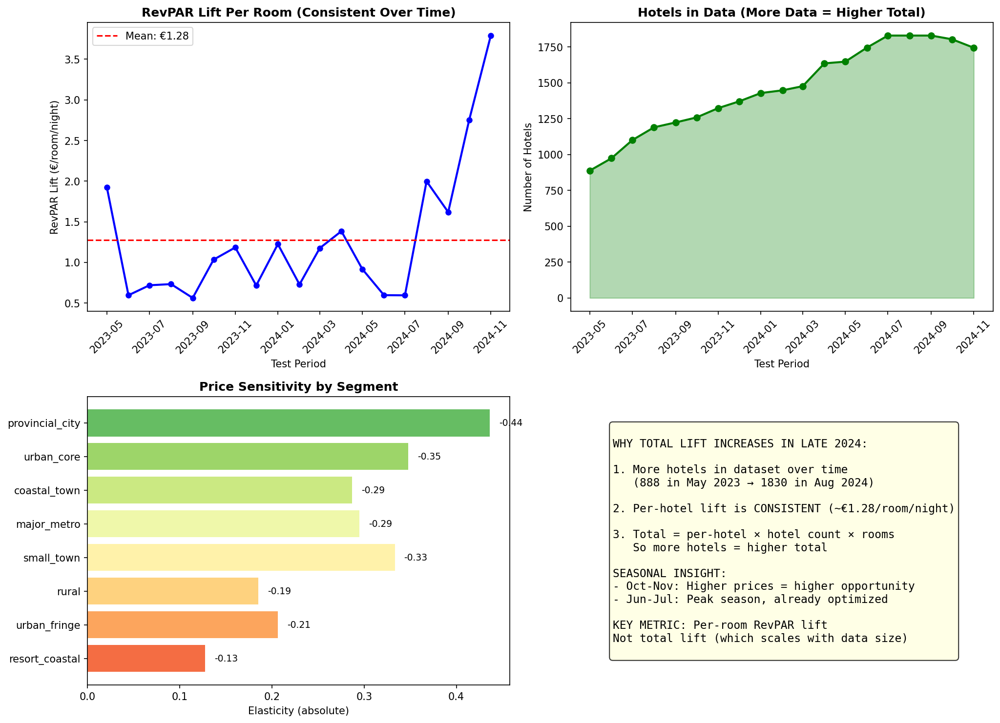

**Understanding the charts:**

1. **Top-left (Per-Room Lift)**: Consistent ~€1.28/room/night average, with variation by season
2. **Top-right (Hotel Count)**: More hotels in later periods (888 → 1830), explaining higher totals
3. **Bottom-left (Elasticity)**: Resort coastal is least elastic (-0.13), provincial city most elastic (-0.44)
4. **Bottom-right (Explanation)**: Total lift = per-room × hotels, so more hotels = higher total

The late-2024 spike is partly due to more hotels in the data and partly due to shoulder season dynamics.

### Price Change Distribution (Hotels with Recommendations)

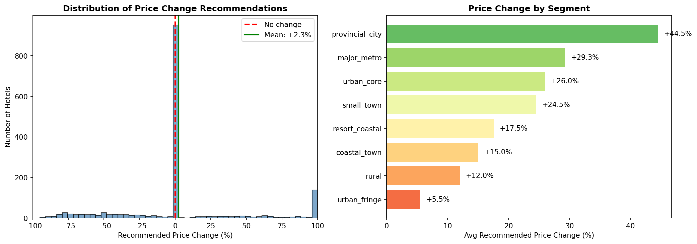

For hotels that receive a price change recommendation (RAISE or LOWER):

| Recommendation | Count | Avg Change |
|----------------|-------|------------|
| RAISE | 733 | +19.9% |
| LOWER | 299 | -18.9% |

The right panel shows how recommendations vary by market segment - resort coastal hotels tend to receive smaller adjustments (tighter peer pricing), while rural hotels see larger swings (more pricing variance among peers).

### Validation

Rolling window validation (4-month train, 1-month test) across 2023-2024:

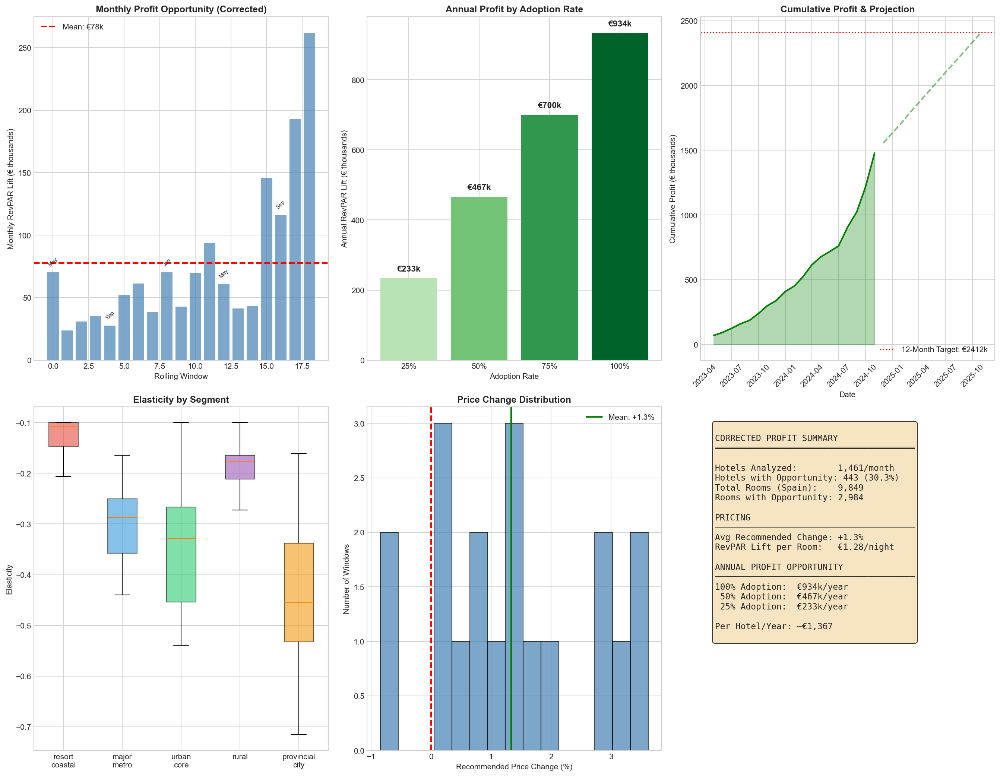

---

## 7. Pipeline Architecture
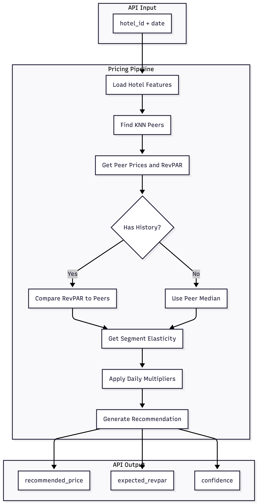


**Cold Start Handling:** Hotels without booking history still get KNN peers based on location and features. The recommendation uses peer median price as a starting point with 30% assumed occupancy.

### API Interface

```python
from src.recommender.pricing_pipeline import PricingPipeline
from datetime import date

pipeline = PricingPipeline()
pipeline.fit()

# Get recommendation for a specific day
rec = pipeline.recommend_daily(hotel_id=123, target_date=date(2024, 6, 15))

# Returns:
# {
#   'hotel_id': 123,
#   'date': '2024-06-15',
#   'segment': 'resort_coastal',
#   'performance': 'underperforming',
#   'recommendation': 'RAISE',
#   'current_price': 95.00,
#   'recommended_price': 108.00,
#   'expected_revpar': 42.50,
#   'elasticity': -0.24,
#   'confidence': 'high'
# }

# Get prices for a week
prices = pipeline.recommend_date_range(hotel_id=123, start_date=date(2024, 6, 15), days=7)
```

---

## 8. Deployment Architecture

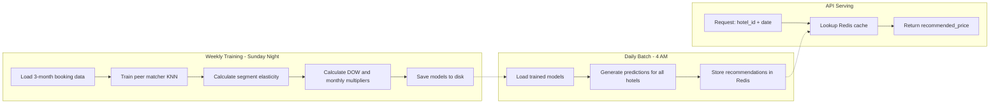

### Configuration

| Parameter | Value | Rationale |
|-----------|-------|-----------|
| Training window | 3 months rolling | Captures recent trends while maintaining sample size |
| Retraining cadence | Weekly (Sunday night) | Balances freshness with compute cost |
| Prediction cadence | Daily (4 AM) | Prices ready before hotel staff check dashboard |
| Cache TTL | 24 hours | Matches prediction cadence |
| KNN neighbors | 10 | Balances peer diversity with similarity |
| Price clamp | ±20% | Ensures adoptable recommendations (based on 63% IQR peer variance) |

### Fallback Behavior

If Redis cache miss occurs (new hotel, cache expired):
1. Real-time KNN lookup against in-memory index
2. Calculate recommendation on-the-fly
3. Cache result for subsequent requests

---

## 9. Future Improvements

**Richer Cold-Start Data:** Ask new hotels for their typical weekday and weekend rates during onboarding. This provides a price anchor for hotels without booking history, improving initial recommendations.

**Booking Prediction Model:** Build a dedicated model to predict daily bookings given price and date. Current approach uses peer occupancy as proxy; direct prediction would improve RevPAR estimation accuracy.

**Event Calendar Integration:** Incorporate local events, holidays, and conferences into pricing. Demand spikes for major events (Mobile World Congress in Barcelona, San Fermín in Pamplona) are predictable and should trigger proactive price increases.

**Competitive Intelligence:** Scrape OTA prices (Booking.com, Expedia) for competitive positioning. This enables recommendations like "You're 20% below competitors for similar rooms."


---

## 10. Key Files

| File | Purpose |
|------|---------|
| [src/recommender/pricing_pipeline.py](src/recommender/pricing_pipeline.py) | Main pricing pipeline with KNN matching and recommendation logic |
| [src/features/engineering.py](src/features/engineering.py) | Feature engineering including market segmentation |
| [src/models/evaluation/rolling_validation.py](src/models/evaluation/rolling_validation.py) | Rolling window validation with segment elasticity calculation |
| [src/data/validator.py](src/data/validator.py) | Data cleaning with 31 validation rules |
| [notebooks/eda/05_elasticity/feature_importance_validation.py](notebooks/eda/05_elasticity/feature_importance_validation.py) | Feature validation with XGBoost and SHAP |

### Running the Model

```bash
# Run rolling validation (generates elasticity and opportunity metrics)
python -m src.models.evaluation.rolling_validation

# Feature importance validation
python notebooks/eda/05_elasticity/feature_importance_validation.py
```
