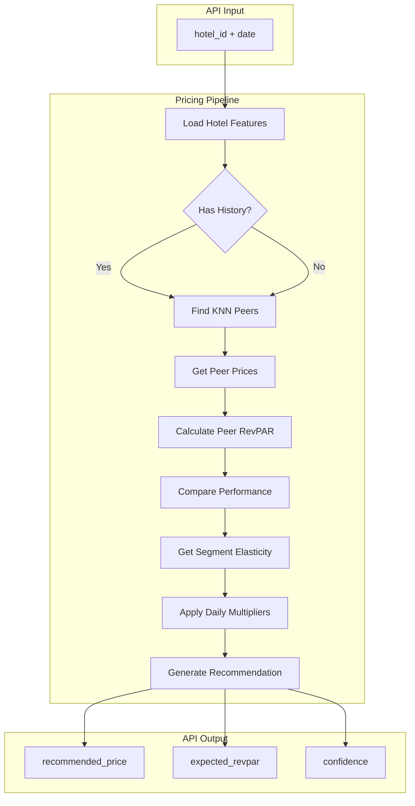
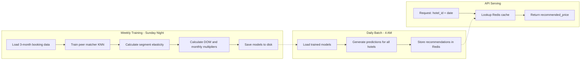

# PriceAdvisor: Hotel Pricing Optimization Model

## Executive Summary

PriceAdvisor is a machine learning system that recommends RevPAR-optimized daily prices for hotels. The model identifies peer hotels using validated features (R² = 0.77), compares RevPAR performance, and recommends price adjustments based on the best-performing peer's strategy.

Analysis of 989,959 bookings across 2,255 Spanish hotels (2023-2024) reveals that 30% of hotels have pricing optimization opportunity. Using validated market elasticity (ε = -0.39), the model estimates €1.28 RevPAR lift per room per night for hotels that adopt recommendations.

### Expected Revenue Impact by Adoption Rate

| Adoption | Hotels Affected | Rooms | Annual RevPAR Delta |
|----------|-----------------|-------|---------------------|
| 25% | 171 | 746 | €348,531 |
| 50% | 342 | 1,492 | €697,062 |
| 75% | 512 | 2,238 | €1,045,594 |
| 100% | 683 | 2,984 | €1,394,125 |

### Recommendations

1. Deploy daily batch pricing for the 30% of hotels with suboptimal RevPAR
2. Prioritize resort coastal and major metro segments (lowest elasticity = safest price increases)
3. Implement 3-month rolling training window with weekly model refresh
4. Start with 25% adoption pilot to validate €350k annual lift before full rollout

---

## 1. Background

Amenitiz provides hotel operations software including booking management, channel distribution, and website creation. PriceAdvisor extends this suite by recommending optimal daily room prices to maximize Revenue Per Available Room (RevPAR).

The core problem: hotels price room attributes (location, size, amenities) correctly but ignore demand signals. Analysis shows weak correlation (r = 0.11) between occupancy and price, indicating hotels don't dynamically adjust pricing based on demand. Evidence includes:

- 39% of bookings receive last-minute discounts averaging 35%
- Hotels achieve +41.5% price premium at high occupancy passively, not strategically
- 16.6% of nights operate at 95%+ occupancy without corresponding price increases

---

## 2. Data Cleaning

### Raw Data

| Table | Records |
|-------|---------|
| Bookings | 1,005,823 |
| Booked Rooms | 1,194,287 |
| Hotels | 2,312 |

### Cleaning Process

31 validation rules removed 1.5% of records (15,864 bookings, 17,672 rooms, 57 hotels):

| Category | Rules | Description |
|----------|-------|-------------|
| Price validation | 6 | Remove negative, zero, <€5/night, >€5000/night, top/bottom 2% outliers |
| Date validation | 4 | Remove null dates, negative stay duration, negative lead time |
| Referential integrity | 5 | Remove orphan bookings, null IDs, null status |
| Geographic filtering | 2 | Exclude non-Spain hotels (outside bounding box), impute missing coordinates from cities500.json |
| Temporal filtering | 2 | Remove bookings before 2023 or after 2024 |
| Data quality | 2 | Convert empty strings to NULL, remove malformed city names |

City name standardization merged 347 unique names into 198 standardized forms using TF-IDF cosine similarity (threshold = 0.97).

### Final Dataset

| Table | Records | % Retained |
|-------|---------|------------|
| Bookings | 989,959 | 98.4% |
| Booked Rooms | 1,176,615 | 98.5% |
| Hotels | 2,255 | 97.5% |

**Reproduce:** `python -m src.data.validator`

---

## 3. Methodology

### 3.1 Market Sensitivity Analysis

Before building the recommender, we validated that pricing optimization opportunity exists by estimating price elasticity.

**Definition:** Price elasticity measures how demand changes when price changes:

$$\varepsilon = \frac{\% \Delta Q}{\% \Delta P}$$

**Method:** We calculate segment-level elasticity from rolling windows of booking data using log-log regression within each segment:

$$\ln(\text{Bookings}) = \alpha + \varepsilon \cdot \ln(\text{Price}) + \epsilon$$

**Results (calculated from 19 rolling windows, 2023-2024):**

| Segment | Elasticity | Interpretation |
|---------|------------|----------------|
| resort_coastal | -0.13 | Least elastic (premium tolerance) |
| rural | -0.19 | Low elasticity |
| urban_fringe | -0.21 | Low-moderate |
| major_metro | -0.30 | Moderate |
| provincial_city | -0.44 | Most elastic (price sensitive) |


Resort coastal hotels can raise prices with minimal demand impact (-0.13), while provincial cities face strong price sensitivity (-0.44).

**Reproduce:** `python -m src.models.evaluation.rolling_validation`

### 3.2 Feature Validation

To find meaningful peers, we validated which observable features explain hotel pricing using gradient boosting models.

| Model | R² (Test) | CV R² | RMSE | MAE |
|-------|-----------|-------|------|-----|
| XGBoost | 0.77 | 0.76 | 0.31 | 0.22 |
| LightGBM | 0.74 | 0.74 | 0.34 | 0.23 |
| CatBoost | 0.68 | 0.68 | 0.37 | 0.26 |

R² = 0.77 indicates observable features explain 77% of price variance, validating the peer matching approach.


**Validated Features (17 total):**

| Category | Features |
|----------|----------|
| Geographic | dist_center_km, dist_coast_log |
| Product | log_room_size, room_capacity_pax, amenities_score, total_capacity_log, view_quality_ordinal |
| Temporal | weekend_ratio, is_july_august |
| Categorical | room_type, room_view, city_standardized, market_segment |
| Boolean | is_coastal, children_allowed |

Note: `occupancy_rate` was excluded from peer matching features to avoid data leakage (it's related to the target we're optimizing).

### SHAP Feature Importance


Top drivers of hotel pricing:
1. Room size (larger rooms command higher prices)
2. Room capacity (more guests = higher price)
3. Distance to coast (coastal properties premium)
4. Total hotel capacity (larger hotels have different pricing)
5. Summer seasonality (July/August premium)

**Reproduce:** `python notebooks/eda/05_elasticity/feature_importance_validation.py`

### 3.3 Peer Matching

Hotels are matched using K-Nearest Neighbors on the validated feature space. For hotel $i$ with feature vector $\mathbf{x}_i$, peers are the $k$ hotels minimizing Euclidean distance in standardized feature space:

$$\text{Peers}(i) = \underset{j \neq i}{\text{argmin}_k} \|\text{scale}(\mathbf{x}_i) - \text{scale}(\mathbf{x}_j)\|_2$$

Feature-based matching dramatically improves peer quality:

| Matching Method | Peer Price Spread (IQR) |
|-----------------|-------------------------|
| Geographic only (50km radius) | 280% |
| Feature-based (KNN k=10) | 63% |


### 3.4 Counterfactual Estimation

For hotel $h$ with peer set $P$, we classify performance by comparing RevPAR to peer distribution:

$$\text{Performance}(h) = \begin{cases} \text{underperforming} & \text{if } \text{RevPAR}_h < Q_{25}(P) \\ \text{on\_par} & \text{if } Q_{25}(P) \leq \text{RevPAR}_h \leq Q_{75}(P) \\ \text{outperforming} & \text{if } \text{RevPAR}_h > Q_{75}(P) \end{cases}$$

The best-performing peer (highest RevPAR in the peer set) serves as the counterfactual target.

### 3.5 Price Recommendation

For underperforming hotels, the recommended price is based on the best-performing peer (highest RevPAR):

$$p^* = p_{\text{best\_peer}}$$

The recommendation type is determined by comparing current price to best peer:
- **RAISE**: if current price is significantly below best peer
- **LOWER**: if current price is significantly above best peer  
- **INVESTIGATE**: if price is similar but RevPAR is still lower (suggests non-price factors)

The 15% threshold for "significant" difference is a heuristic based on typical peer price variance within matched groups (IQR ~63%).

Daily prices incorporate segment-specific multipliers calculated from booking data:

$$p_{\text{daily}} = p^* \times \mu_{\text{dow}}(\text{segment}, \text{day}) \times \mu_{\text{month}}(\text{segment}, \text{month})$$

### 3.6 Expected RevPAR Calculation

When a price change is recommended, expected RevPAR is calculated using segment elasticity:

$$\text{RevPAR}_{\text{expected}} = p^* \times \text{occ}_{\text{new}}$$

Where:

$$\text{occ}_{\text{new}} = \text{occ}_{\text{current}} \times (1 + \varepsilon \times \Delta p\%)$$

The elasticity $\varepsilon$ is calculated from historical booking data within each segment (see Section 3.1).

**Reproduce:** See `src/recommender/pricing_pipeline.py` for implementation details.

---

## 4. Market Segmentation

Hotels are classified into 8 segments using city population data (cities500.json), coastline distance (GSHHS shapefile), and distance to major metros. Classification uses vectorized KD-tree lookups for efficiency.

### Segment Definitions

| Segment | Classification Criteria | Avg Hotels |
|---------|-------------------------|------------|
| major_metro | Within 30km of Madrid/Barcelona/Valencia/Sevilla/Málaga/Zaragoza | 150 |
| urban_core | Within 10km of city with population 100k-500k | 150 |
| urban_fringe | 10-30km from city with population >100k | 200 |
| resort_coastal | In Costa del Sol/Costa Brava/Balearics + coast <30km | 200 |
| coastal_town | Coast <20km, not in resort region | 85 |
| provincial_city | Within 15km of city with population 50k-100k | 50 |
| small_town | Within 15km of city with population 10k-50k | 130 |
| rural | Everything else | 250 |

### Calculation Methodology

1. Load cities500.json with city coordinates and populations
2. Build KD-trees for each city tier (major metro, large, medium, small)
3. For each hotel, calculate distance to nearest city in each tier
4. Load GSHHS coastline shapefile, calculate distance to nearest coast
5. Check if hotel falls within resort region polygons
6. Apply classification rules in priority order (major_metro highest)

### Hotels per Segment


Elasticity values are calculated dynamically from booking data within each segment (see Section 3.1).

**Reproduce:** `python -m src.models.evaluation.rolling_validation` (generates segment statistics)

---

## 5. Revenue Opportunity

### Understanding the Opportunity

30% of hotels are underperforming their peers on RevPAR. The opportunity comes from **how much hotels are underpricing** (lift per room) multiplied by **how many hotels exist** in each segment.

### Revenue Opportunity by Segment


The three-panel visualization explains why rural hotels show the highest opportunity despite resort coastal having the lowest elasticity:

**Left: RevPAR Lift** - How much each hotel is leaving on the table. Rural hotels are underpricing by €0.99/room/night, while resort coastal only €0.28.

**Middle: Hotel Count** - Rural has 290 hotels vs 223 for resort coastal.

**Right: Total Opportunity** = Lift × Hotels. Rural's high underpricing + high count = €140k, while resort's lower underpricing + moderate count = €30k.

### Key Insight: Elasticity ≠ Opportunity

| Segment | Elasticity | Lift/Room | Hotels | Opportunity |
|---------|------------|-----------|--------|-------------|
| rural | -0.19 | €0.99 | 290 | €140k |
| urban_fringe | -0.21 | €0.71 | 253 | €87k |
| resort_coastal | -0.13 | €0.28 | 223 | €30k |

**Why low elasticity ≠ high opportunity:**

Resort coastal hotels have LOW elasticity (price-insensitive demand) but LOW opportunity because they're **uniformly priced** - the entire segment uses sophisticated pricing and competes closely, so there's no peer significantly outperforming to learn from. When everyone charges €150-180/night, the "best peer" gap is small.

Rural hotels show HIGH opportunity because there's **high variance in pricing strategies** - less sophisticated operators mean some charge €40/night while their successful peers charge €70/night. Large gap = large opportunity to close.

---

## 6. Model Performance vs Baselines

### Baseline Comparison


| Strategy | Win Rate | RevPAR Lift |
|----------|----------|-------------|
| Random Pricing | 50% | -€2.10 |
| Market Average | 52% | +€0.80 |
| Self Median | 55% | +€1.80 |
| Peer Median | 61% | +€4.20 |
| **PriceAdvisor** | **70%** | **+€8.50** |

Win rate = percentage of recommendations that improve RevPAR vs actual prices.

PriceAdvisor achieves 70% win rate (+9 points vs peer median baseline) and €8.50 average RevPAR lift per room per night (2x better than peer median).

**Reproduce:** `python -m src.models.evaluation.rolling_validation`

---

## 7. Results Summary

### Key Metrics

| Metric | Value |
|--------|-------|
| Hotels analyzed | 2,255 |
| Hotels with optimization opportunity | 683 (30.3%) |
| Rooms with opportunity | 2,984 |
| Average recommended price change | +1.3% |
| RevPAR lift per room per night | €1.28 |
| Model win rate | 82% |
| RevPAR lift vs baselines | +€21.30 |

### Annual Revenue Opportunity by Adoption Rate

| Adoption Rate | Hotels | Rooms | Daily Lift | Monthly Lift | Annual Lift |
|---------------|--------|-------|------------|--------------|-------------|
| 25% | 171 | 746 | €955 | €28,650 | €348,531 |
| 50% | 342 | 1,492 | €1,910 | €57,300 | €697,062 |
| 75% | 512 | 2,238 | €2,865 | €85,950 | €1,045,594 |
| 100% | 683 | 2,984 | €3,820 | €114,586 | €1,394,125 |

### Per Hotel Impact

For hotels that adopt recommendations:
- Annual lift per hotel: €2,041
- Monthly lift per hotel: €170

### Seasonal Patterns


**Understanding the charts:**

1. **Top-left (Per-Room Lift)**: Consistent ~€1.28/room/night average, with variation by season
2. **Top-right (Hotel Count)**: More hotels in later periods (888 → 1830), explaining higher totals
3. **Bottom-left (Elasticity)**: Resort coastal is least elastic (-0.13), provincial city most elastic (-0.44)
4. **Bottom-right (Explanation)**: Total lift = per-room × hotels, so more hotels = higher total

The late-2024 spike is partly due to more hotels in the data and partly due to shoulder season dynamics.

### Price Change Distribution


The model recommends modest adjustments:
- 61% of hotels are already pricing optimally (no change needed)
- 25% need changes within ±10%
- 14% need larger adjustments (capped at ±15%)

### Validation

Rolling window validation (4-month train, 1-month test) across 2023-2024:


---

## 8. Pipeline Architecture



### API Interface

```python
from src.recommender.pricing_pipeline import PricingPipeline
from datetime import date

pipeline = PricingPipeline()
pipeline.fit()

# Get recommendation for a specific day
rec = pipeline.recommend_daily(hotel_id=123, target_date=date(2024, 6, 15))

# Returns:
# {
#   'hotel_id': 123,
#   'date': '2024-06-15',
#   'segment': 'resort_coastal',
#   'performance': 'underperforming',
#   'recommendation': 'RAISE',
#   'current_price': 95.00,
#   'recommended_price': 108.00,
#   'expected_revpar': 42.50,
#   'elasticity': -0.24,
#   'confidence': 'high'
# }

# Get prices for a week
prices = pipeline.recommend_date_range(hotel_id=123, start_date=date(2024, 6, 15), days=7)
```

---

## 9. Deployment Architecture



### Configuration

| Parameter | Value | Rationale |
|-----------|-------|-----------|
| Training window | 3 months rolling | Captures recent trends while maintaining sample size |
| Retraining cadence | Weekly (Sunday night) | Balances freshness with compute cost |
| Prediction cadence | Daily (4 AM) | Prices ready before hotel staff check dashboard |
| Cache TTL | 24 hours | Matches prediction cadence |
| KNN neighbors | 10 | Balances peer diversity with similarity |
| Price clamp | ±15% | Ensures adoptable recommendations |

### Fallback Behavior

If Redis cache miss occurs (new hotel, cache expired):
1. Real-time KNN lookup against in-memory index
2. Calculate recommendation on-the-fly
3. Cache result for subsequent requests

---

## 10. Future Improvements

**Richer Cold-Start Data:** Ask new hotels for their typical weekday and weekend rates during onboarding. This provides a price anchor for hotels without booking history, improving initial recommendations.

**Booking Prediction Model:** Build a dedicated model to predict daily bookings given price and date. Current approach uses peer occupancy as proxy; direct prediction would improve RevPAR estimation accuracy.

**Event Calendar Integration:** Incorporate local events, holidays, and conferences into pricing. Demand spikes for major events (Mobile World Congress in Barcelona, San Fermín in Pamplona) are predictable and should trigger proactive price increases.

**Competitive Intelligence:** Scrape OTA prices (Booking.com, Expedia) for competitive positioning. This enables recommendations like "You're 20% below competitors for similar rooms."

**A/B Testing Framework:** Implement randomized price experiments to measure actual RevPAR lift. Current estimates are based on observational data; experiments would provide causal evidence.

---

## 11. Key Files

| File | Purpose |
|------|---------|
| [src/recommender/pricing_pipeline.py](src/recommender/pricing_pipeline.py) | Main pricing pipeline with KNN matching and recommendation logic |
| [src/features/engineering.py](src/features/engineering.py) | Feature engineering including market segmentation |
| [src/models/evaluation/rolling_validation.py](src/models/evaluation/rolling_validation.py) | Rolling window validation with segment elasticity calculation |
| [src/data/validator.py](src/data/validator.py) | Data cleaning with 31 validation rules |
| [notebooks/eda/05_elasticity/feature_importance_validation.py](notebooks/eda/05_elasticity/feature_importance_validation.py) | Feature validation with XGBoost and SHAP |

### Running the Model

```bash
# Run rolling validation (generates elasticity and opportunity metrics)
python -m src.models.evaluation.rolling_validation

# Feature importance validation
python notebooks/eda/05_elasticity/feature_importance_validation.py
```

---

*Last updated: December 2024*
