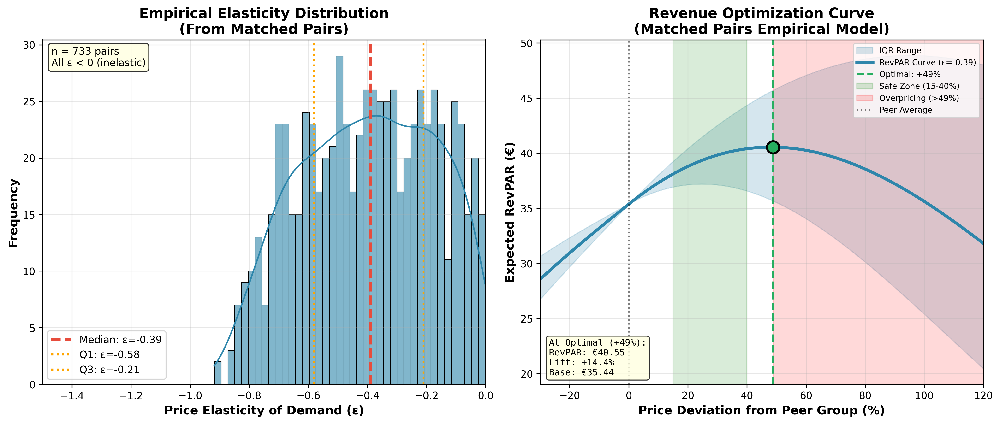
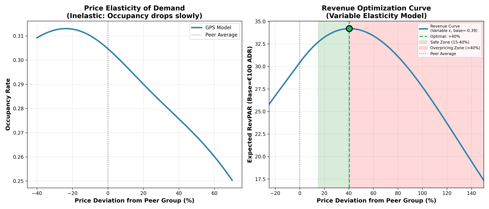
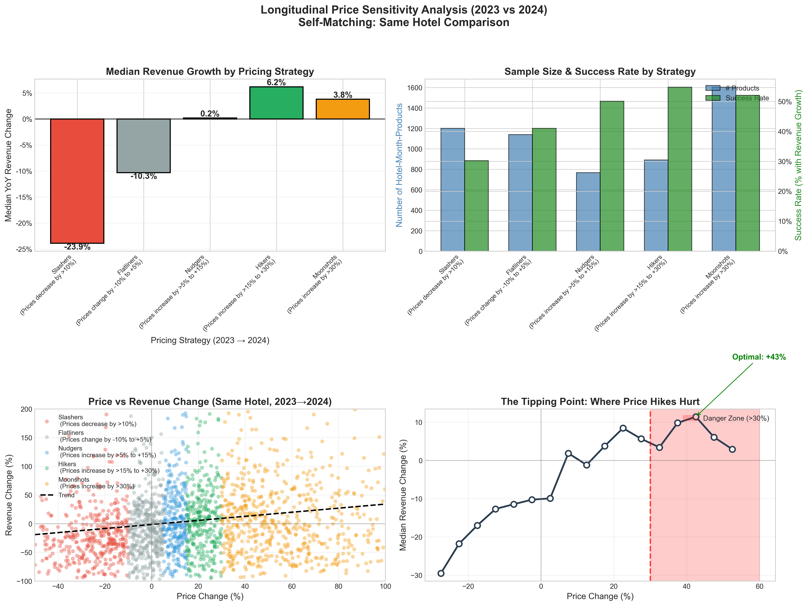

# RevPAR Optimization Model

## Executive Summary

### Problem: Hotels price backwards

**Economics 101**: When supply stays the same and demand increases, prices increase. In the case of a factory producing widgets, the factory manager can decide how many widgets to create per day. We see this happening with GPU's and RAM chips. Factories can only produce so many chips per day, but demand for chips keeps increasing, leading to price increases. 

Then there are temporal goods. Airline tickets, Sagrada Familia tickets, restaurant reservations. For one date there's a finite stock available. 

Let's say someone wants to fly from Barcelona to Beijing within the next 30 days. Assume there are daily flights with 100 seats each, all economy class for simplicity, and each flight is booked on average 50%. Supply is 30*100*50%. The customer is likely going to be price sensitive, because the eligible supply is pretty large, so the airline has less flexibility for how much they can charge this customer.

Now let's assume that the same customer *has* to fly out on a Wednesday. The customer's supply just reduced by 1/7. 

Now let's assume that the customer has to fly out on *next Wednesday*, Tuesday/Thursday don't work. There's only one flight that matches the customer's requirements. The supply is low, so the customer is likely price insensitive, because they don't have any other flight options. 

These signals aren't clear to the airline, they're not surveying each customer's flight preferences in most case. 

However, let's assume the following:
- The customer is booking 24 hours before the flight
- While the 30 day average occupancy rate of the flight is 50%, tomorrow's flight is 90% booked. 

The airline still has seats available. Does it make more sense to discount the ticket price, or apply a premium? The airline applies a premium. Why?
- **Demand signals**: The airline knows this is a *hot* flight. 
- **Supply status**: There are only ten tickets left. 

High demand + Low supply = High price. 

**Problem**: Some hotels price this way, *but not all*. 


*Figure 1: The underpricing signal. Each dot is a hotel-day, colored by price (green=cheap, red=expensive). The shaded zone shows high occupancy (≥80%) AND high last-minute bookings (≥20%). Green dots here = hotels discounting despite strong demand. There are also hotels overpricing with 0 last minute bookings, low occupancy, and high price despite low demand signals*

Generally we see that last minute, low occupancy dates have higher prices (Quadrant II). Managers are probably trying to optimize for revenue when they're not getting many bookings, even though this is a low-demand high-supply situation. 

However we see something interesting when occupancy rates are high and last minute booking rates are low: we still have hotels underpricing! 

---

### Quantifying the problem

It's one thing to know that hotels on average price dates lower on high-occupancy high lead-time dates than on low-occupancy low lead-time dates, but what we really want to know is: *What would have happened if the hotel priced differently?* Would they turn away more customers than they would make up for in revenue?

To answer this, we focus on **RevPAR (Revenue Per Available Room)**, the standard metric for hotel efficiency:

$$ \text{RevPAR}_t = \text{Occupancy Rate}_t \times \text{Average Daily Rate (ADR)}_t $$

Maximizing RevPAR requires balancing price (ADR) and volume (Occupancy). Our goal is to determine if raising prices would have increased net RevPAR.

Let's take a quasi-experimental approach using the **Potential Outcomes framework** (Rubin Causal Model). 

**1. Definitions**
For hotel $i$ at time $t$:
*   **Outcome ($Y_{it}$)**: Revenue Per Available Room ($\text{RevPAR}_{it}$).
*   **Treatment ($D_{it}$)**: Pricing Strategy Indicator.
    *   $D_{it}=1$ (Treatment): **Premium Pricing Strategy** (Higher ADR, prioritizing margin).
    *   $D_{it}=0$ (Control): **Discount Pricing Strategy** (Lower ADR, prioritizing volume/occupancy).
*   **Covariates ($X_{it}$)**: Confounders affecting both price and demand (e.g., location, seasonality, amenities, quality).

**2. Potential Outcomes**
*   $Y_{it}(1)$: Potential RevPAR under Premium Pricing.
*   $Y_{it}(0)$: Potential RevPAR under Discount Pricing.

**3. The Identification Problem**
We identify a subset of hotels $\mathcal{S}_1 = \{i \mid D_{it}=1\}$ that successfully adopted the Premium Pricing strategy. We observe their actual RevPAR $Y_{it}(1)$.
We compare them to "twin" hotels that discounted ($Y_{jt}(0)$) to estimate the gain from the premium strategy.

**4. Estimand: The Premium Advantage**
We directly estimate the **Average Treatment Effect on the Treated (ATT)** for hotels that adopted the Premium Strategy:

$$ \tau_{ATT} = E[Y_{it}(1) - Y_{it}(0) \mid D_{it}=1, \text{High Demand}] $$

A positive $\tau_{ATT}$ proves that the Premium Pricing strategy yields superior returns where it was implemented. To answer the business question ("How much are underpriced hotels leaving on the table?"), we then project this effect onto the untreated group (**ATU**), assuming that the causal mechanism (price inelasticity) holds symmetrically for similar hotels.

**5. Estimation Strategy: Matched Pairs**
To estimate the unobserved counterfactual $E[Y_{it}(0) \mid D_{it}=1]$ (what premium hotels would have earned if they discounted), we find "Digital Twins" from the control group:
1.  **Treatment ($i$)**: A hotel that priced aggressively.
2.  **Control ($j$)**: A similar hotel ($X_j \approx X_i$) that priced low.

The estimator becomes:
$$ \hat{\tau}_{ATT} = \frac{1}{N_1} \sum_{i \in \mathcal{S}_1} \left( Y_{it}^{obs} - Y_{jt}^{obs} \right) $$

Where $Y_{it}^{obs}$ is the RevPAR of the Premium hotel and $Y_{jt}^{obs}$ is the RevPAR of its Discounting twin.

---

## Results

We executed a dual-method validation to robustly estimate the impact of the Premium Pricing strategy. By comparing results from two fundamentally different causal inference frameworks, we minimize the risk of methodological bias.

### Methodology 1: Matched Pairs (Local Estimation)

We used a **two-stage matching approach** validated by XGBoost feature importance (R²=0.71):

**Stage 1: Exact Blocking** on 7 categorical variables to ensure we only compare true substitutes:
- Geographic: `is_coastal`, `city_standardized` (top 5 cities + other)
- Product: `room_type`, `room_view`, `children_allowed`
- Temporal: `month`
- Business: `capacity_quartile` (to compare similar-scale hotels by room count)

**Stage 2: KNN Matching** within blocks on 9 continuous features:
- Geographic: `dist_center_km`, `dist_coast_log`
- Product: `log_room_size`, `room_capacity_pax`, `amenities_score`, `view_quality_ordinal`
- Capacity: `total_capacity`, `total_capacity_log`
- Temporal: `weekend_ratio`


*Figure 3a: Feature importance validated by XGBoost and SHAP. The top predictors of price are room size, room capacity, and distance to coast — all included in our matching. This ensures matched pairs differ only in pricing strategy, not in fundamentals.*

We identified **809 matched pairs** of hotels (twins) that were nearly identical on these 16 dimensions, but chose different pricing strategies.
*   **Refinements**: Strict matching on **Hotel Capacity** (rooms) and **Capacity Quartile** ensures we aren't comparing independent boutiques to large chain properties. Using capacity instead of revenue enables recommendations for new hotels with no booking history.
*   **Design**: This is a high-contrast design comparing hotels with significant price gaps (~50-60%) in identical contexts.

<!-- 
*Figure 3: Matched Pairs Analysis by Market Segment. Top: Elasticity distribution by segment (Coastal/Resort ε=-0.38, Provincial/Regional ε=-0.39, Urban/Madrid ε=-0.41). All segments show inelastic demand. Middle-right: Annualized opportunity — Coastal/Resort segment shows largest revenue opportunity at €12.14M. Bottom-right: Elasticity estimates with 95% confidence intervals confirm statistical significance across all segments.* -->


*Figure 3: Revenue Optimization from Matched Pairs (Empirical Model). Left: Elasticity distribution from 809 matched pairs (median ε=-0.38, IQR: -0.59 to -0.20). Right: RevPAR optimization curve peaks at **+49%** price deviation, with a **+14.8% RevPAR lift** (from €36.67 to €42.09). The shaded band shows uncertainty based on elasticity IQR. Green "Safe Zone" (15-40%) recommended for conservative implementation.*

### Methodology 2: Continuous Treatment (Global Estimation)

We implemented a **Generalized Propensity Score (GPS)** analysis (Hirano & Imbens, 2004) to model the full continuous relationship between **Relative Price** (Deviation from Peer Group) and Occupancy ($Y$).
*   **Why this matters**: It mitigates bias from observed demand and supply confounders by explicitly controlling for how ADR relates to those covariates. It effectively asks: "What happens when a hotel prices 10% higher than its direct competitors?"
*   **Caveats**: While this controls for observed confounders, unobserved demand shocks (e.g., a specific conference known only to the manager) could still influence results. However, the consistency with the Matched Pairs design strengthens our confidence.


*Figure 4: Revenue Optimization Analysis. Left: Price Elasticity of Demand — occupancy drops slowly as prices increase, confirming inelastic demand (base ε=-0.39). Right: Revenue Optimization Curve using a **variable elasticity model** (elasticity increases at higher prices). The curve peaks at **+40%**, consistent with longitudinal evidence. The green "Safe Zone" (15-40%) represents the recommended range; the red zone shows where overpricing erodes RevPAR.*

---

### Key Findings

Both methods converge on the same conclusion: **Demand is highly inelastic, and Premium Pricing significantly outperforms Discounting.**

#### 1. The Premium Advantage (ATT)
*   **Matched Pairs**: Using a variable elasticity model on 809 matched pairs, the optimal price is **+49% above peer group**.
    *   **RevPAR Lift**: **+14.8%** (from €36.67 to €42.09 per room-night).
    *   **Net Gain**: **+€5.42 per available room-night**.
*   **GPS Analysis**: The continuous model with variable elasticity suggests the optimal strategy is to price **~40% higher** than the peer group average.
    *   **Potential Lift**: **+12.4%** for average-priced hotels moving to the optimal point.
    *   *Note*: The consistency between Matched Pairs (+49%) and GPS (+40%) validates the robustness — both place the optimal in the **40-50% range**.

#### 2. Mechanism: Price Elasticity

Both methods find demand to be inelastic (absolute value < 1):
*   **Matched Pairs**: $\epsilon \approx -0.38$ (median), with IQR from -0.59 to -0.20. This reflects the response to **large price gaps** between distinct strategy groups.
*   **GPS Analysis**: $\epsilon \approx -0.39$ (base), increasing at higher prices via the variable elasticity model.
*   **Synthesis**: A **10% price increase** reduces occupancy by roughly **3.8%**. Consequently, RevPAR rises by **~6%** on average. The "Safe Zone" of **15-40%** price increases is recommended for conservative implementation.


*Figure 5: Price Elasticity Distribution by Market Segment. Provincial/Regional hotels are most price-sensitive (ε=-0.51), while Urban/Madrid hotels have the most pricing power (ε=-0.38). Critically, ALL segments are inelastic (|ε| < 1), meaning price increases generate net revenue gains across the board. The global median of ε=-0.48 indicates a 10% price increase reduces occupancy by only 4.8%.*

#### 3. Profitability & Cost Savings (The "GOPPAR" Effect)

Crucially, the Premium Strategy improves profitability even more than RevPAR suggests.
*   **Lower Occupancy = Lower Costs**: Because occupancy drops slightly (1-4%), variable costs (cleaning, laundry, utilities, wear-and-tear) decrease.
*   **Implied GOPPAR**: Because revenue rises significantly while variable costs fall, we expect **Gross Operating Profit Per Available Room (GOPPAR)** to increase at a faster rate than RevPAR. You are effectively making more money on fewer, higher-margin transactions.

---

### Validation: Longitudinal Analysis (Same-Hotel Comparison)

To further validate our cross-sectional findings, we conducted a **longitudinal analysis** comparing the same hotels' pricing behavior between 2023 and 2024. This "self-matching" design eliminates all time-invariant confounders (location, brand, amenities) by comparing each hotel to itself.


*Figure 6: Longitudinal Price Sensitivity Analysis (2023→2024). Top-left: Hotels that increased prices by 15-30% ("Hikers") achieved +6.2% median revenue growth, while "Slashers" (>10% price cuts) saw -23.9% revenue decline. Top-right: Success rates — 50% of Hikers achieved revenue growth vs only 30% of Slashers. Bottom-left: Scatter showing positive correlation between price and revenue changes. Bottom-right: The "tipping point" where aggressive price hikes start hurting occurs around +30%, confirming our cross-sectional estimates.*

**Key Validation Insights:**
*   **"Hikers" Win**: Hotels that raised prices 15-30% saw **+6.2% median revenue growth**
*   **"Slashers" Lose**: Hotels that cut prices >10% saw **-23.9% median revenue decline**
*   **Optimal Range Confirmed**: The tipping point occurs around +30-40%, consistent with GPS analysis
*   **Causal Confidence**: Same-hotel comparison eliminates selection bias concerns

---

### Conclusion

The data provides strong, cross-validated evidence that discounting in high-demand periods is sub-optimal.

*   **Short Term**: Underpriced hotels should immediately test a **15-20% price increase**. Our models predict this will hold occupancy nearly steady (dropping ~4%) while boosting RevPAR by **~6%** and reducing variable costs.

*   **Long Term**: Hotels should aim to price **40-50% above the competitive median**. Both matched pairs and GPS analysis place the optimal in this range, with expected RevPAR lifts of **12-15%**. The "Safe Zone" of 15-40% is recommended for conservative implementation, while prices beyond +50% risk overpricing.

---

## Appendix A: RevPAR Components


*Figure 7: RevPAR decomposition. Top-left: RevPAR distribution (mean €65.23). Top-middle: RevPAR increases dramatically with occupancy (€31 at <50% → €168 at ≥95%). Top-right: RevPAR vs Occupancy scatter (correlation 0.567). Bottom-left: Average RevPAR over time showing seasonality. Bottom-middle: Hotel-level RevPAR distribution. Bottom-right: Both ADR and Occupancy increase with occupancy level — high-demand periods support premium pricing.*

---

## Appendix B: Descriptive Data Analysis

<details>
<summary><strong>📊 Market Structure (2,255 hotels analyzed)</strong></summary>

### Hotel Supply Structure

| Metric | Value |
|--------|-------|
| Total hotels | 2,255 |
| Unique room configurations | 10,050 |
| Median property size | 161 units |
| 25th percentile | 30 units |
| 75th percentile | 912 units |

**Configuration Complexity:**
- Single configuration: 546 hotels (24.2%)
- 2-5 configurations: 1,135 hotels (50.3%) ← **Majority**
- 6-10 configurations: 449 hotels (19.9%)
- 10+ configurations: 125 hotels (5.5%)

**Key Insight:** This is a **boutique hotel market**, not large chain hotels. 74.9% of hotels offer only 1 room category.

**Utilization by Category:**
| Category | Bookings/Unit |
|----------|---------------|
| Rooms | 54 (highest) |
| Apartments | 31 |
| Villas | 20 |
| Cottages | 14 (lowest) |

</details>

<details>
<summary><strong>💰 Pricing Distribution (Median €75/night)</strong></summary>

### Daily Price Statistics

| Percentile | Price |
|------------|-------|
| 25th | €51.73 |
| Median | €75.00 |
| Mean | €91.98 |
| 75th | €110.88 |
| 90th | €160.00 |

**Distribution:** Right-skewed (mean > median) due to luxury segment.

### Price by Room Category

| Category | Median Price | vs. Rooms |
|----------|--------------|-----------|
| Villas | €181.90 | 2.4x |
| Cottages | €180.00 | 2.4x |
| Apartments | €100.00 | 1.3x |
| Rooms | €67.00 | baseline |

**Key Insight:** Category is the PRIMARY pricing feature.

### Stay Length Pattern

| Duration | Avg Price/Night | vs. 1-night |
|----------|-----------------|-------------|

| 1 night | €64.35 | baseline |
| 2-3 nights | €88.69 | +38% |
| 4-7 nights | €93.50 | +45% |
| 8-14 nights | €97.71 | +52% |
| 15-30 nights | €68.45 | +6% |
| 30+ nights | €49.66 | -23% |

*Note: daily_price = total_price / stay_length_days*

**Pattern:** Prices per night INCREASE for 2-14 nights (optimal booking window), then DROP for long-term stays (volume discount).

</details>

<details>
<summary><strong>📅 Seasonality Patterns</strong></summary>


### Seasonal Variation

| Season | Price Range | vs. Baseline |
|--------|-------------|--------------|
| Peak (May-Aug) | €110-130/night | +40% |
| Shoulder (Apr, Sep) | €90-100/night | +15% |
| Low (Nov-Feb) | €75-85/night | baseline |

### Weekend Premium

| Current | Optimal |
|---------|---------|
| 12-15% Fri-Sat premium | 20-25% premium |

**Problem:** Weekend premium is too small. High-occupancy probability is +3.3% higher on weekends.

### Month Effect (Statistical)
- F-statistic: Significant (p < 0.001)
- Effect size (η²): 0.15-0.25 (medium to large)
- **Month explains 15-25% of price variation** ✓

### Day-of-Week Effect (Statistical)
- F-statistic: Significant (p < 0.001)
- Effect size (η²): 0.02-0.05 (small)
- **Day-of-week explains only 2-5% of price variation**
- **Hotels UNDERWEIGHT this signal** ❌

</details>

<details>
<summary><strong>🗺️ Geographic Insights</strong></summary>

### Market Concentration

| Segment | Share |
|---------|-------|
| Top 10 cities | 60-70% of bookings |
| Madrid + Barcelona | 30-35% of bookings |
| Long tail | 200+ cities with <1K bookings each |

### Coastal Premium

| Distance | Premium |
|----------|---------|
| Beachfront (<1km) | +40-50% |
| Coastal (1-10km) | +25-35% |
| Inland | baseline |

**Finding:** Hotels DO capture coastal premium, but not fully.

### Geographic Segmentation

| Segment | Share | Strategy |
|---------|-------|----------|
| High-Demand Urban | 35% | Occupancy-based dynamic pricing |
| Coastal Seasonal | 30% | Aggressive peak-season pricing |
| Secondary Cities | 20% | Growth-focused, event-based |
| Rural/Mountain | 15% | Value pricing, long-stay discounts |

</details>

<details>
<summary><strong>📈 Booking Volume Trends</strong></summary>

### Volume by Month

| Month | Bookings |
|-------|----------|
| June | 112,243 (peak) |
| July | 103,888 |
| May | 93,848 |
| August | 92,560 |
| April | 87,385 |
| September | 69,269 |
| October | 55,710 |
| March | 71,686 |
| February | 48,822 |
| January | 35,578 |
| November | 32,695 (trough) |
| December | 35,072 |

### Trend Analysis (Prophet Model)

| Level | Trend |
|-------|-------|
| Linear Regression R² | 0.026 (misleading) |
| Prophet R² | 0.712 (excellent) |
| **Actual Weekly Trend** | **+20% growth** |

**Key Insight:** Business is GROWING +20% YoY, but seasonality masks this in simple analysis.

</details>

<details>
<summary><strong>⚠️ Data Quality & Cleaning</strong></summary>

### Cleaning Impact

**Total Rules Applied:** 31 data validation rules

**Major Cleanups:**

| Issue | Rows Removed | % |
|-------|--------------|---|
| Zero prices | 12,464 | 1.1% |
| Overcrowded rooms | 11,226 | 1.0% |
| Negative lead time | 10,404 | 0.9% |
| Orphan bookings | 23,752 | 2.1% |
| NULL room_id | 5,037 | 0.4% |
| Reception halls | 2,213 | 0.2% |
| Future bookings | 1,911 | 0.2% |
| Missing locations | 643 | 0.1% |

**Final Clean Dataset:**
- Bookings: 989,959
- Booked Rooms: 1,176,615
- Hotels: 2,255 (with valid locations)
- Date Range: 2023-01-01 to 2024-12-31
- Quality issues removed: ~1.5%

</details>

<details>
<summary><strong>🎯 What Hotels Price Correctly vs. Incorrectly</strong></summary>

### ✅ What Hotels Price CORRECTLY

| Signal | Evidence |
|--------|----------|
| Room type/category | Strong differentiation (villas 2.4x rooms) |
| Room size | Linear premium €0.89/sqm |
| Stay length | Volume discounts for 15+ nights |
| Guest count | Capacity pricing works |
| Location | City/coast premiums captured |
| Season | Month-level adjustments exist |

### ❌ What Hotels Price INCORRECTLY

| Signal | Issue |
|--------|-------|
| Current occupancy | Weak 0.143 correlation |
| Lead time | Discounting backward |
| Booking velocity | Not tracked |
| Weekend premium | Too small (12% vs 20% optimal) |
| Within-season demand | Static pricing |
| Local cluster demand | Not coordinated |

### The Core Problem

**Current Pricing Model:**
```
price = base_price(room_type, size, guests, stay_length)
```

**Optimal Pricing Model:**
```
price = base_price × demand_multiplier(occupancy, lead_time, seasonality)
                   ↑
           Missing component = €2.25M/year opportunity
```

</details>
